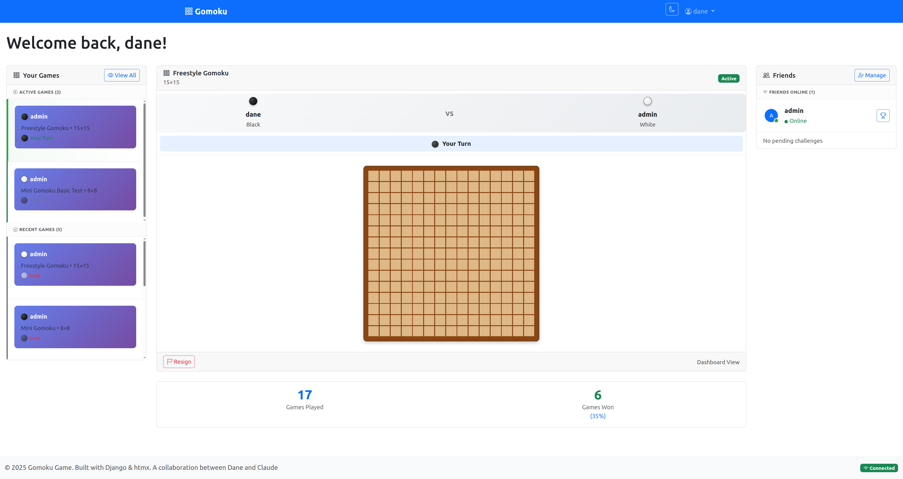

# Go Goban Go Game System



A modern, full-stack implementation of Gomoku and Go board games featuring a Django web application with PostgreSQL database, responsive Bootstrap 5 + htmx interface, and real-time multiplayer functionality.

## Supported Games

### What is Gomoku?

Gomoku (五目並べ, "five points in a row") is an abstract strategy board game traditionally played with Go pieces on a Go board. The objective is to be the first player to form an unbroken chain of exactly five stones horizontally, vertically, or diagonally.

### What is Go?

Go (囲碁, Weiqi) is an ancient strategy game where players use black and white stones to control territory on a board. Players alternate placing stones to surround territory and capture opponent stones. The game ends when both players pass, and the winner is determined by controlled territory plus captured stones.

### Gomoku Rules

**Basic Rules:**
- Two players alternate placing black and white stones on a board
- The first player to get exactly 5 stones in a row wins
- Standard boards are 15×15 or 19×19
- In most variations, overlines (6+ stones in a row) do not count as wins

**Rule Variations Supported:**

1. **Standard Gomoku** - Exactly 5 in a row wins, overlines don't count
2. **Renju** - 15×15 board with forbidden moves for Black:
   - 3-3: Cannot create two open rows of 3 simultaneously
   - 4-4: Cannot create two rows of 4 simultaneously  
   - Overlines: Black cannot create 6+ in a row
3. **Freestyle Gomoku** - Overlines count as wins
4. **Caro** - Must have unblocked 5-in-a-row or overlines to win
5. **Swap2 Opening** - Tournament standard opening protocol

### Tournament History

Gomoku has been played competitively since 1989, with modern tournaments using the Swap2 opening rule since 2009 to balance the first-player advantage.

## Architecture

This web-only implementation consists of the following components:

- **Web Application**: Django web application with Bootstrap 5 + htmx responsive interface
- **Real-Time Features**: Server-Sent Events (SSE) and WebSocket notifications for multiplayer functionality
- **Database**: PostgreSQL for persistent game storage with Django admin interface
- **Authentication**: Django session-based authentication (no API tokens)
- **Containerization**: Docker Compose for easy development and deployment
- **Game Logic**: Service layer architecture supporting multiple game types (Gomoku, Go)

## Installation

### Prerequisites

- Python 3.12 or higher (3.9+ supported)
- [UV package manager](https://github.com/astral-sh/uv) 
- Docker and Docker Compose
- Git
- Chrome and/or Firefox browsers (for Selenium testing)

### Setup

1. **Clone the repository:**
```bash
git clone <repository-url>
cd gomoku_claude
```

2. **Install dependencies with UV:**
```bash
# Install all dependencies (workspace setup)
uv sync
```

3. **Start the database services:**
```bash
# Development mode (database port exposed on 5434)
docker compose up -d postgres
```

4. **Run database migrations:**
```bash
# Apply all migrations to set up database schema
cd backend
uv run python manage.py migrate
```

5. **Create a superuser (optional):**
```bash
uv run python manage.py createsuperuser
# Or use the provided script: uv run python create_superuser.py
```

6. **Seed the database with test data (optional):**
```bash
uv run python manage.py seed_data
```

## Usage

### Development Mode

**Start the Django web server:**
```bash
cd backend
uv run python manage.py runserver 8001
```
Services available:
- **Web Interface**: http://localhost:8001/ (Bootstrap 5 + htmx responsive web app)
- **Admin Interface**: http://localhost:8001/admin/ (admin / admin123)

**Note**: The web interface provides complete gameplay functionality including real-time multiplayer, authentication, and game management.

**Database Access:**
- PostgreSQL: `localhost:5434` (exposed for development tools)
- Django Admin: http://localhost:8001/admin/ (replaces pgAdmin)

### Production Mode

**Using Docker Compose:**
```bash
# Start all services in production mode
docker compose --profile production up -d
```

## Web Interface Features

The Django web application provides comprehensive game functionality through a modern web interface:

### User Management
- User registration and authentication (Django sessions)
- User profiles and statistics
- Password management and security

### Game Management  
- Create and join games with different rulesets
- Real-time move synchronization via Server-Sent Events
- Game history and statistics tracking
- Multiple board sizes: 9×9, 13×13, 15×15, 19×19, 25×25

### Social Features
- Friend system with requests and management
- Challenge system between friends
- Real-time notifications for game events
- Online player tracking

### Multi-Game Support
- **Gomoku**: Traditional 5-in-a-row with multiple rule variations
- **Go**: Territory control game with komi, handicaps, and standard scoring
- Extensible architecture for adding new game types

## Development Features

### Django Admin Interface
The Django admin interface provides a comprehensive view of all game data:
- **User Management**: View and manage players, including statistics
- **Game Management**: View games with visual board previews
- **Rule Sets**: Configure different game variations
- **Real-time Monitoring**: Track player sessions and game events

### Game Service Layer
The game logic is implemented in a service layer that handles:
- Move validation (bounds checking, turn validation)
- Win detection (5-in-a-row in all directions)
- Game state management
- Board initialization and updates

### Database Models
- **User**: Player accounts with game statistics
- **GomokuRuleSet / GoRuleSet**: Configurable game rule variations (subclassed architecture)
- **Game**: Individual game sessions with board state (supports both game types)
- **GameMove**: Move history and validation
- **Challenge**: Player-to-player game invitations
- **Friendship**: Friend relationships and requests between users

## Testing

### Unit and Integration Tests
Run the Django test suite:
```bash
cd backend
# Run all tests (350+ total including centralized notifications)
uv run python manage.py test

# Run web interface tests (80+ tests, including panel and centralized system tests)
uv run python manage.py test web

# Run specific test categories
uv run python manage.py test web.test_phase11_panels      # Panel tests
uv run python manage.py test web.test_phase12_single_view # Single-view dashboard tests
uv run python manage.py test web.test_websocket_consumer  # WebSocket tests

# Run with verbose output
uv run python manage.py test --verbosity=2
```

### Selenium End-to-End Tests
Run comprehensive browser automation tests for real-time multiplayer functionality:
```bash
cd backend
# Run all Selenium tests
uv run python -m pytest tests/test_selenium_multiplayer.py -v

# Run real-time SSE tests  
uv run python -m pytest tests/test_sse_real_time.py -v

# Run cross-browser tests (requires both Chrome and Firefox)
uv run python -m pytest tests/test_cross_browser_sse.py -v

# Run specific test categories
uv run python -m pytest -m selenium -v
uv run python -m pytest -m sse -v
uv run python -m pytest -m cross_browser -v
```

**Test Coverage:**
- **Web Interface Tests**: 80+ comprehensive TDD tests for web functionality (includes friend system, panels, single-view dashboard, and WebSocket integration)
- **Game Logic Tests**: Multi-game architecture tests for Gomoku and Go service layers
- **Model Tests**: Database model validation and subclassed RuleSet architecture
- **Centralized System Tests**: Tests for WebSocketNotificationService, CSRF handling, and race condition fixes
- **Panel Tests**: 20 TDD tests for Phase 11 enhanced web interface features (navigation, games table, dashboard layout)
- **Single-View Tests**: 12 TDD tests for Phase 12 embedded game board and dashboard integration
- **WebSocket Tests**: Comprehensive testing for centralized notification system and real-time updates
- **Integration Tests**: End-to-end workflows and edge cases with centralized architecture
- **Selenium Tests**: Real-time multiplayer functionality with cross-browser support
  - **Multiplayer Game Flow**: Two-player sessions with real-time move propagation
  - **SSE Real-Time Updates**: Server-Sent Events testing with sub-2-second latency validation
  - **Cross-Browser Compatibility**: Chrome ↔ Firefox interoperability testing
  - **Connection Resilience**: SSE reconnection, multiple tabs, and browser limits testing

## Configuration

### Environment Variables
Create a `.env` file in the backend directory:
```env
DEBUG=True
SECRET_KEY=your-secret-key-here
DB_NAME=gomoku_db
DB_USER=gomoku_user
DB_PASSWORD=your-password-here
DB_HOST=localhost
DB_PORT=5434
```

### Database Configuration
The application uses PostgreSQL with the following default connection:
- Host: localhost
- Port: 5434 (exposed from Docker)
- Database: gomoku_db
- User: gomoku_user

## Project Structure

```
gomoku_claude/
├── backend/              # Django web application
│   ├── gomoku/          # Django project settings
│   ├── users/           # User management app
│   ├── games/           # Game logic and models (multi-game architecture)
│   ├── web/             # Web interface app (Bootstrap + htmx)
│   ├── core/            # Shared utilities and commands
│   ├── templates/       # Django templates (base + web)
│   ├── static/          # CSS, JavaScript, images
│   └── manage.py        # Django management script
├── archived/            # Archived components (API, desktop GUI)
│   ├── api/             # Archived REST API components
│   └── frontend/        # Archived Dear PyGUI desktop client
├── docker-compose.yml   # Docker services configuration
├── data/               # Persistent data volumes
├── MD.md               # Master documentation index
└── README.md           # This file
```

## Contributing

This project follows Test-Driven Development (TDD) principles:
1. Write tests for new features first
2. Implement the minimal code to pass tests
3. Refactor while keeping tests green

Key development practices:
- Use Django's built-in testing framework
- Follow Django coding conventions
- Use the Django admin for data management
- Implement comprehensive error handling

## Recent Major Changes

- ✅ **Phase 15: Multi-Game Architecture & Project Cleanup** (Latest): Complete RuleSet subclassing and API removal
  - **Multi-Game Architecture**: Abstract RuleSet base class with GomokuRuleSet and GoRuleSet subclasses
  - **Service Layer Abstraction**: GameServiceFactory supporting multiple game types (Gomoku, Go)
  - **Standardized Board Sizes**: 9×9, 13×13, 15×15, 19×19, 25×25 with proper validation
  - **REST API Removal**: Archived unused Django REST Framework components for web-only architecture
  - **Frontend Archival**: Moved unused Dear PyGUI desktop client to archived/ directory
  - **Documentation Master Index**: Created MD.md for comprehensive documentation navigation
  - **Clean Web-Only Architecture**: Simplified to Django sessions + htmx with real-time WebSocket notifications
- ✅ **Phase 13: Challenge System Simplification & Game View Improvements**: Enhanced UX and simplified workflows
  - **Quick Challenge Removal**: Eliminated confusing quick challenge functionality per user request
  - **Enhanced Game Board UX**: Preview stone hover with color indication and smooth animations
  - **Game View Switching Prevention**: Fixed jarring view switching when other players make moves
- ✅ **Phase 12: Single-View Dashboard with Embedded Game Board**: Unified interface with embedded gameplay
  - **Embedded Game Display**: Full game functionality within dashboard center panel
  - **Game Selection Logic**: Most recent active game shown by default with URL parameter support
  - **Real-Time Dashboard Updates**: SSE updates for both game board and dashboard panels simultaneously
- ✅ **Phase 11: Enhanced Web Interface with Dynamic Panels**: Complete dashboard redesign with real-time panels
  - **3-Column Dashboard**: Left panel (games), center (main content), right panel (friends) with responsive mobile design
  - **Games Table View**: Converted from card layout to sortable table with turn indicators, opponent info, and direct game links
  - **Real-Time Panel Updates**: All panels update automatically via SSE when moves are made or game state changes
  - **Dynamic Games Panel**: Shows active games + 5 most recent finished games with visual turn indicators
  - **Friends Panel**: Online friends display with challenge buttons and quick challenge functionality
  - **20 New TDD Tests**: Comprehensive test coverage following strict RED-GREEN-REFACTOR methodology
  - **Enhanced Navigation**: Removed non-functional challenges menu item, streamlined user experience
- ✅ **Project Cleanup & Maintenance Ready**: Clean codebase ready for production deployment
  - Removed temporary SSE debugging files from development process
  - Fixed test compatibility with current CSRF implementation
  - All 334+ tests passing with clean project structure
  - Turn validation improvements for better user experience
- ✅ **SSE Real-Time Multiplayer COMPLETE**: All critical SSE functionality working flawlessly
  - Fixed HTML escaping in SSE data transmission (`json_encode=False`)
  - Resolved CSRF token handling in dynamically updated content
  - Simplified HTMX SSE extension approach, removing complex JavaScript workarounds
  - Real-time board updates work seamlessly with proper stone rendering
  - Template-level turn validation prevents out-of-turn moves
- ✅ **Selenium Testing Framework**: Comprehensive browser automation testing for real-time multiplayer
  - Real-time SSE move propagation testing with sub-2-second latency validation
  - Cross-browser compatibility testing (Chrome ↔ Firefox)
  - Connection resilience testing (reconnection, multiple tabs, browser limits)
  - End-to-end multiplayer game flow automation
- ✅ **Production-Ready Web Interface**: Complete responsive web app using Bootstrap 5 + HTMX
  - Dynamic board sizing with CSS custom properties (8×8 to 25×25 boards)
  - Ruleset name display instead of UUIDs for better UX
  - Optimized game ordering and display
- ✅ **Friend System**: Complete friend request/accept/reject system with TDD (25 tests)
- ✅ **TDD Methodology**: 350+ comprehensive tests for all systems following TDD methodology
- ✅ **Django Migration Complete**: Migrated from FastAPI to Django + DRF with centralized architecture
- ✅ **Admin Interface**: Built-in Django admin replaces pgAdmin
- ✅ **Comprehensive Testing**: 350+ tests with Django test framework integration and centralized service testing
- ✅ **Service Layer**: Clean separation of business logic with centralized WebSocket notification service
- ✅ **Database Optimization**: Strategic indexing and query optimization
- ✅ **Production Ready**: All 15 phases complete with multi-game architecture and clean web-only design

## License

[Add your license information here]